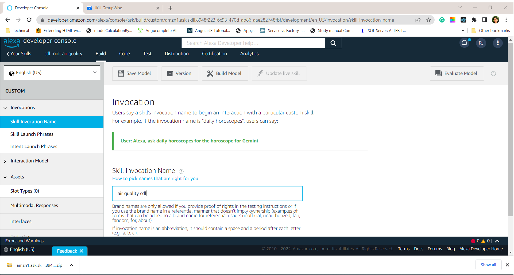
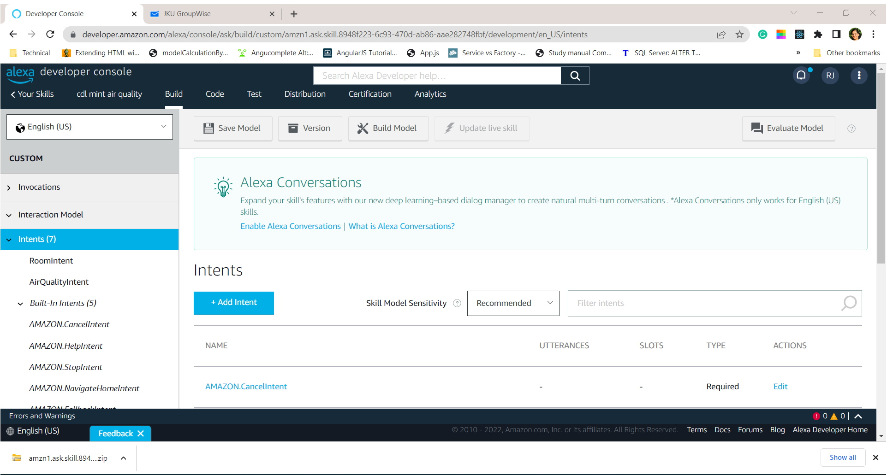
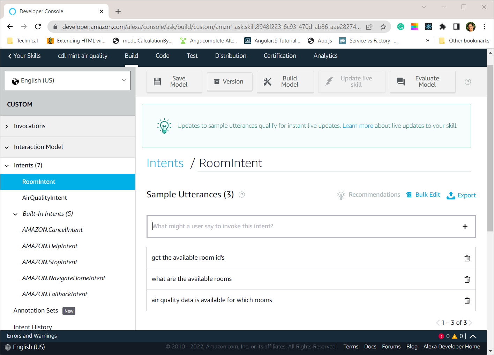
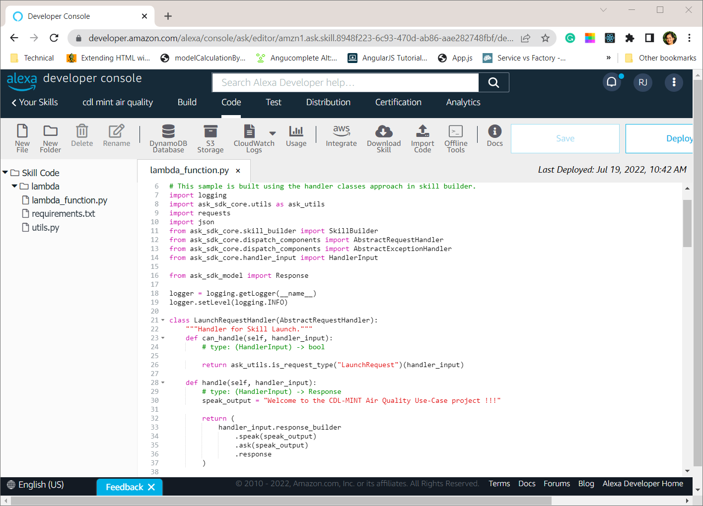
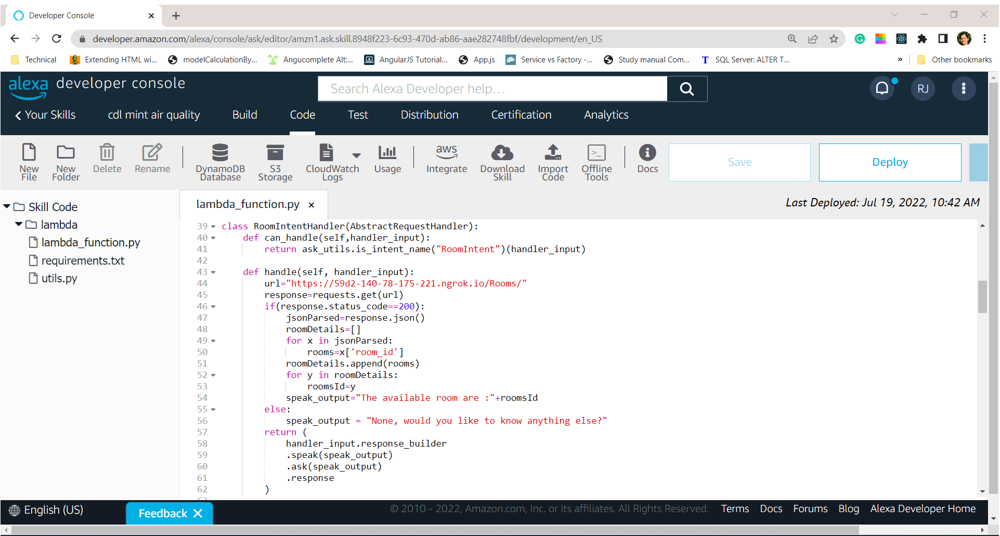

# Alexa_Air Quality
The project contains the python alexa skill set that are used for retrieving the air quality information from server.

Login into the alexa developer console and set up the credentials. Alexa performs the actions based on the commands or utterences provided in the alexa developer console.

The creation of skill, intent and set up is explained in the following steps.

##### Creation of Alexa Skill

 First the alexa skill is created by clicking the create skill button in the developer console.  The skill "cdl mint air quality" is created. After creating the skill, we need to initiate the skill with the invocation name. For example, the skill invocation name provided is "air quality cdl". In the console, the skill has to be invoked first by typing the invocation name.

Invoke the skill with invocation name.

##### Creation of Intent

For the custom interaction model with alexa, create the intent. Intent represents an action that fullfill's the user request (utterence) provided in console. The intent is created by clicking on the Add Intent button as displayed in figure. for example the RoomIntent is created for the air quality use case.

##### Sample Phrases for Intent

The intents are identified based on the sample utterences provided. The sample phrases used for the conversation are called as the utterences. The sample phrases for the room intent are shown in the figure. When these phrases are typed in the console, the action is performed by calling the intent and the response is provided by alexa accordingly.

##### Handling Intent

The intent is handled by the python code, when we navigate to the code tab, the python code for alexa is present, the requirements for the project can be found in requirements.txt folder. First the skill is invoked, which is handled by the LaunchRequest and alexa gives the sample response as shown in figure.

The room intent is handled by class RoomIntentHandler as shown in figure. The fast api rest interface is hosted in web for public access and ssl certificate. The python requests library handles the url and parses the json response. The response is provided as speech in alexa console. 

